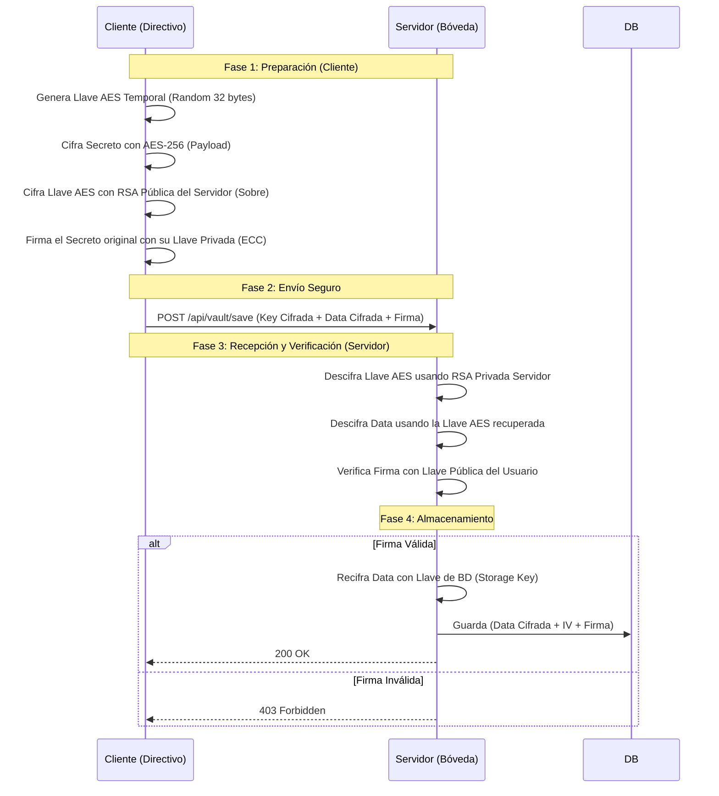

# Bóveda Secreta

Este proyecto es una prueba de concepto de un sistema de **mensajería y almacenamiento seguro** ("Bóveda") desarrollado en Node.js. Implementa estándares criptográficos modernos para garantizar la confidencialidad, autenticidad, integridad y no repudio de la información.

## Características Principales

El sistema simula un cliente enviando un secreto (ej. "La fórmula de la Coca-Cola") a un servidor, asegurando el flujo completo:

* **Cifrado Híbrido (Sobre Digital):**
    * Uso de **AES-256-CBC** para cifrar el mensaje (simétrico/rápido).
    * Uso de **RSA-2048** para cifrar la llave AES (asimétrico/seguro).
* **Firma Digital (No Repudio):**
    * Uso de Curvas Elípticas (**ECC secp256k1**) para firmar el mensaje original.
    * El servidor verifica la firma para garantizar que el mensaje viene del usuario legítimo y no ha sido alterado.
* **Seguridad de Contraseñas:**
    * Hashing con **Bcrypt** y Salt para el almacenamiento de credenciales.
* **Datos en Reposo:**
    * El servidor vuelve a cifrar los datos antes de guardarlos en la base de datos interna usando una llave derivada con **Scrypt**.

## Tecnologías

* **Runtime:** Node.js
* **API:** Express
* **Criptografía:** Módulo nativo `crypto`, `bcrypt`
* **Cliente HTTP:** Axios

## Flujo de Ejecución

1.  **Registro:** El cliente se registra y genera un par de llaves ECC (para firmar).
2.  **Handshake:** El cliente obtiene la Llave Pública RSA del servidor.
3.  **Preparación del Payload:**
    * Se genera una llave aleatoria AES.
    * Se cifra el secreto con AES.
    * Se cifra la llave AES con la Pública RSA del servidor (Encapsulamiento).
    * Se firma el secreto original con la Privada ECC del cliente.
4.  **Envío:** Se envían los datos cifrados y la firma al servidor.
5.  **Recepción y Verificación:**
    * El servidor descifra la llave AES (usando su Privada RSA).
    * Descifra el mensaje.
    * Verifica la firma contra la llave pública del usuario.
    * Si es válido, cifra el dato nuevamente y lo guarda en la BD.

## Instalación y Uso

1.  **Clonar el repositorio**
    ```bash
    git clone https://github.com/IrvingYael05/Boveda-Secreta.git
    cd Boveda-Secreta
    ```

2.  **Instalar dependencias**
    ```bash
    npm install express axios bcrypt cors
    ```

3.  **Ejecutar el Servidor**
    En una terminal:
    ```bash
    node server.js
    ```

4.  **Ejecutar el Cliente (Prueba)**
    En otra terminal:
    ```bash
    node client.js
    ```

## 📊 Diagrama de Secuencia



## Notas de Seguridad

* Las llaves RSA del servidor se generan automáticamente en la carpeta `./keys` si no existen.
* **Importante:** En un entorno de producción real, las llaves privadas nunca deben estar expuestas ni generarse en tiempo de ejecución sin gestión segura (KMS).

---
**Autor:** Irving Yael Vázquez Serrano